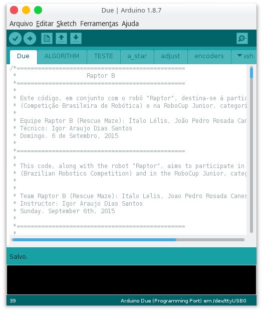

# Arduino Due

This is the source code for the Arduino Due.

The Arduino Due is used as the main board. It executes functions to handle actuators and most sensors.

## Files

- [``Due.ino``](Due.ino)
	- Main file, in which libraries are linked, variables are declared and containing ``void setup ()`` and ``void loop ()``.

- [``ALGORITHM.ino``](ALGORITHM.ino)
	- Contains the function ``void tremaux ()``, the main function of the code, which is directly called on ``void loop ()``. It's responsible for executing the Trémaux Algorithm and calling other functions when necessary.

- [``adjust.ino``](adjust.ino)
	- Adjust robot in the square, correcting its angle and centering its position. It uses ultrasonic and infrared sensors to adjust.

- [``a_star.ino``](a_star.ino)
	- Special version of the A* algorithm, responsible for the making the robot coming back to its start position. Based on the project [A* Search on Processing](https://github.com/italohdc/maze-solving).

- [``encoders.ino``](encoders.ino)
	- Functions to move the robot around using the encoders. There's a implemention of a PID with the encoders.

- [``flash.ino``](flash.ino)
	- Stores on flash memory information about the maze, in the case the robot needed to be restarted during the round. Not used on the final version, due to some errors on recording and reading data.

- [``lcd.ino``](lcd.ino)
	- Draw maze and print data on the LCD display.

- [``leitura.ino``](leitura.ino)
	- Read and return data from sensors.

- [``map.ino``](map.ino)
	- Orient robot on the maze, saving its Cartesian position and handling robot orientation.

- [``maze.ino``](maze.ino)
	- Deletes a route in case its a dead-end, avoiding the robot to take this path again.

- [``menu.ino``](menu.ino)
	- Menu run on startup to select which "program" the robot should execute (main, check sensors, test code...).

- [``motor.ino``](motor.ino)
	- Functions to handle motors.

- [``quadrantes.ino``](quadrantes.ino)
	- Some standard functions for the robot to move around.

- [``rampa.ino``](rampa.ino)
	- Analyze if the robot is on the ramp and make the robot goes up/down on the ramp without crashing in the walls.

- [``tasks_m.ino``](tasks_m.ino)
	- Check sensors and print them on the LCD display.

- [``TESTE.ino``](TESTE.ino)
	- A sandbox file (used for tests and implementing quick functions).

- [``vitima.ino``](vitima.ino)
	- Read temperature sensors from Arduino Nano and search for heat victims.