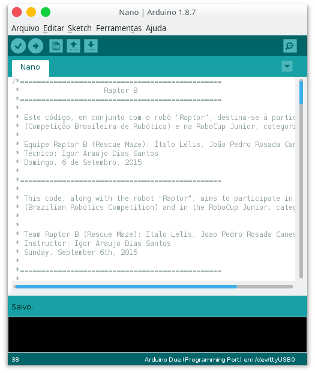

# Arduino Due

This is the source code for the Arduino Nano.

The Arduino Nano is used as the secondary board. It reads the heat sensor and communicates with the main board (Arduino Due).

---

\* Some unnecessary comments were removed for a better visualization. To see the original version, [check it here](https://github.com/italohdc/Raptor-B/tree/fbef40a7e1edeab37877cb6db84d7a86ed44b7b6/Nano).