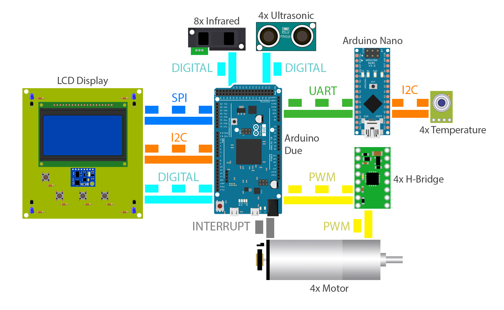

    

> Saturday. July 2nd, 2016

# Raptor B - RoboCup Rescue Maze

**Raptor B Team:**
- Italo Lelis de Carvalho, João Pedro Rosada Canesin

**Instructor:**
- Igor Araujo Dias Santos

---

## Software

### Tremaux Algorithm 

For instance it's used an algorithm called "Tremaux". This algorithm has as it's main logic to make the robot go right always as possible. If the robot cannot go right, it goes forward and, in the last scenario, goes left.

You can read more about Tremaux Algorithm in here: http://blog.jamisbuck.org/2014/05/12/tremauxs-algorithm.html

### A* Algorithm

To make the robot return to it's initial position, a pathfinder algorithm called A* (A-Star) is used. Both distances of each position to the destination and to the actual position are evaluated , and them the algorithm route the path with the least sum of those distances. This assures that the robot will follow the shortest path possible to it's initial position.

The implementation of the algorithm is based on the project [A* Search on Processing](https://github.com/italohdc/maze-solving).

## Hardware

We used two microcontrollers on the robot: an [Arduino Due](Due/) as the main board and an [Arduino Nano](Nano/) as a secondary board.

The [Arduino Due](Due/) executes functions to handle actuators and most sensors, as well as the main algorithm.

The [Arduino Nano](Nano/) reads the heat sensor and communicates with the main board.

### Components

- Microcontrollers
    - **Arduino Due** (Main):
        - 1x **Light sensors**
        - 1x **Inertial Measurement Unit**
        - 4x **Ultrasonic sensors**
        - 8x **Infrared sensors**
    - **Arduino Nano** (Secondary):
        - 4x **Temperature sensors**

- Motors
    - 4x **DC Motors** (connected to H-Bridges)
    - 1x **Servo Motors**

- LCD Display
    - **LEDs**
    - **Push-Buttons**

---

## Prizes

| Year | Competition           | Location               | Position |
|------|-----------------------|------------------------|----------|
| 2012 | LARC* / CBR**         | Fortaleza, Brazil      | 2nd      |
| 2013 | RoboCup Junior        | Eindhoven, Netherlands | 2nd      |
| 2013 | LARC/CBR              | Fortaleza, Brazil      | 1st      |
| 2014 | RoboCup Junior        | João Pessoa, Brazil    | 3rd      |
| 2014 | LARC/CBR              | São Carlos, Brazil     | 1st      |
| 2015 | LARC/CBR              | Uberlândia, Brazil     | 1st      |
| 2016 | RoboCup Junior        | Leipzig, Germany       | 9th      |

\* LARC - Latin American Robotics Competition

\** CBR - Brazilian Robotics Competition

## Acknowledgments

This project was made possible with the effort of many people. There was hard work and countless nights staying up until late.

I would like to thanks those indirectly related to this project, as our parents, faculty and event organizers. Also, a special thanks to those directly related to this project, who helped it grow the way it did:

- [Colégio Nossa Senhora de Fatima - Sacramentinas](http://colegiosacramentinas.com.br/)
- Andrique Figueiredo Amorim
- Daniel Hymer dos Santos Frota
- Hugo Santos Dias
- Joao Paulo Sandes Brito
- Joao Pedro Vilas Boas Silva
- Luiz Victor Fonseca Brasil
- Luisa Silva Oliveira
- Marilia de Mello Amorim Novais e Silva
